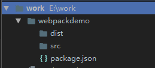
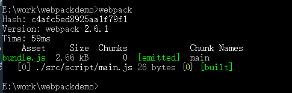

# webpack安装与基本配置
## 安装node和npm
首先我们需要安装**node**和**npm**
```
$ node -v
```
查看node版本
```
$ npm -v
```
查看npm版本
## 初始化一个webpack项目
* 进入E盘,新建work文件夹，打开并新建文件夹webpackdemo,进入webpackdemo文件夹
```
$ e:
$ mkdir work
$ cd work
$ mkdir webpackdemo
$ cd webpackdemo
```
* 初始化npm
```
$ npm init
```
这时webpackdemo根目录下会出现一个**package.json**文件，这个文件定义了这个项目所需要的各种模块，以及项目的配置信息（比如名称、版本、许可证等元数据）。`npm install` 命令根据这个配置文件，自动下载所需的模块，也就是配置项目所需的运行和开发环境。
* 安装webpack
```
$ npm install webpack --save-dev
```
新建src文件夹用于存放项目源码，新建dist文件夹用于存放打包后的文件
```
$ mkdir src
$ mkdir dist
```
此时项目目录为


# 初始化项目文件
* 给项目新建一个初始化页面，并在初始化页面中引入打包后生成的bundle.js文件
```
//index.html

<!DOCTYPE html>
<html lang="en">
<head>
    <meta charset="UTF-8">
    <title>webpackdemo</title>
</head>
<body>
    <div id="root">

    </div>
    <script src="bundle.js"></script>
</body>
</html>
```
* 在src文件夹下创建script文件夹用语存储项目的js文件,在script文件夹下创建main.js作为打包的入口文件
* 新建style文件夹用语存储项目的css文件
* 在根目录下为这个项目创建一个webpack的配置文件webpack.config.js，并写入基本配置
```
//webpack.config.js

module.exports = {
    //“__dirname”是node.js中的一个全局变量，它指向当前执行脚本所在的目录。
    entry: __dirname + "/src/script/main.js",//已多次提及的唯一入口文件
    output: {
        path: __dirname + "/dist/js",//打包后的文件存放的地方
        filename: "bundle.js"//打包后输出文件的文件名
    }
}
```
在终端运行 `webpack` 会成功打包


* 如果需要在打包时使用更多参数，可以配合npm使用，在package.json文件中有个script属性，可以配置为
```
// package.json

  "scripts": {
    "test": "echo \"Error: no test specified\" && exit 1",
    "webpack" : "webpack --config webpack.config.js --progress --display-modules --colors --display-reasons"
  },
```
这样可以设置为webpack打包时使用的配置文件、打包过程、打包的模块、输出结果为彩色、打包的原因，然后只需要在终端运行 `npm run webpack` 就可以执行打包


